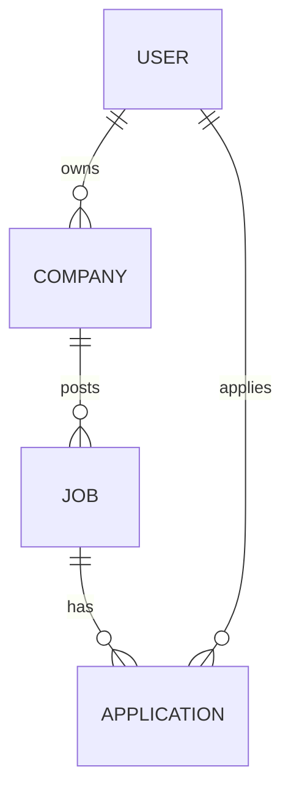
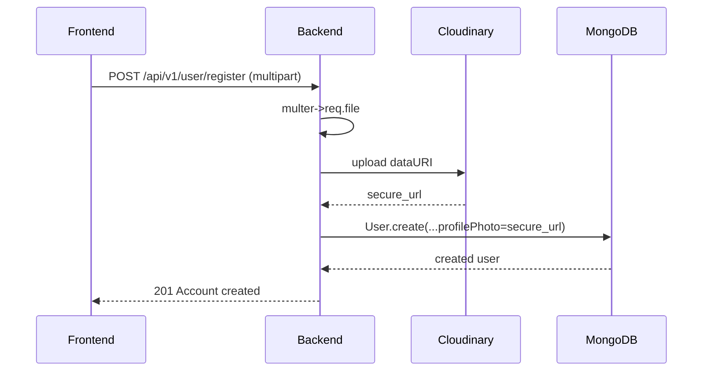

# JobScout — Project Documentation

## 1. Project Overview

### Purpose
JobScout is a full‑stack job portal that helps students/job-seekers discover and apply for jobs, and enables recruiters/companies to create company profiles, post jobs, and manage applicants.

### Problem it solves
Provides a lightweight recruitment workflow: company creation, job posting, searching, resume upload, application tracking, and simple admin controls for applicant shortlisting.

### Main features
- User registration and login (roles: `student`, `recruiter`)
- Profile management with resume upload and profile photo
- Company registration and logo upload
- Job posting, searching, and updating
- Apply to jobs and view application status
- Admin views: company management, job management, applicants list, status updates

### User roles
- `student` — job seeker who can browse jobs and apply.
- `recruiter` — company user who can register a company, post and manage jobs, view applicants, and update application statuses.


## 2. Tech Stack Analysis

- Frontend: React 19, Vite, React Router v7
- State Management: Redux Toolkit, redux-persist (localStorage wrapper)
- Styling/UI: Tailwind CSS, shadcn components, sonner (toasts), lucide-react icons, framer-motion
- HTTP Client: Axios
- Backend: Node.js, Express (ES module), Multer (file parsing), Cloudinary (file hosting)
- Database: MongoDB via Mongoose ODM
- Authentication: JWT tokens signed server-side, stored in httpOnly cookie `token`
- Deployment/build: Frontend: Vite build; Backend: Node process (start via `node src/server.js` or `nodemon` in dev)
- Third-party services: Cloudinary for image/resume hosting


## 3. System Architecture

- Single Page App (React) communicates with RESTful Express API under `/api/v1/*`.
- Files are uploaded to backend (multer memoryStorage), converted to data URI, then uploaded to Cloudinary.
- Backend uses Mongoose models for data persistence in MongoDB.

Mermaid architecture diagram:

```mermaid
flowchart LR
  subgraph Frontend
    A[Browser / React App]
  end
  subgraph Backend
    B[Express Routes]
    C[Controllers]
    D[Auth Middleware]
    E[Cloudinary]
    F[MongoDB (Mongoose)]
  end
  A -->|REST API (axios, withCredentials)| B
  B --> D
  B --> C
  C --> E
  C --> F
```


## 4. Folder Structure (important files)

- backend/
  - package.json — backend dependencies & scripts
  - src/
    - server.js — DB connect + app.listen
    - app.js — express app and route mounts
    - db/db.js — mongoose connection helper
    - constant.js — DB_NAME
    - routes/ — route definitions: `user.route.js`, `company.route.js`, `job.route.js`, `application.route.js`
    - controllers/ — business logic handlers
    - models/ — Mongoose models: `User`, `Company`, `Job`, `Application`
    - middlewares/ — `auth.middleware.js`, `multer.middleware.js`
    - utils/ — `cloudinary.js`, `datauri.js`
- frontend/
  - package.json — frontend deps & scripts
  - src/
    - main.jsx — React mount, Redux Provider, PersistGate
    - App.jsx — routes
    - components/ — UI + pages
    - redux/ — slices & store
    - utils/constant.js — API endpoint constants


## 5. Feature Documentation (internal)

### Authentication
- Signup: `POST /api/v1/user/register` expects multipart/form-data with `fullName, email, phoneNumber, password, role` and `file` (profile photo). Controller uploads `file` to Cloudinary and stores `profile.profilePhoto`.
- Login: `POST /api/v1/user/login` expects JSON `{email, password, role}`. On success server signs JWT and sets httpOnly cookie `token`.
- Logout: `GET /api/v1/user/logout` clears the `token` cookie.
- Protected routes: middleware reads cookie `token`, verifies JWT, and sets `req.id` to the authenticated user id.

### Jobs
- Post job: `POST /api/v1/job` (auth) with fields `title, description, requirement (CSV), salary, location, jobType, experience, position, companyId`.
- Search jobs: `GET /api/v1/job?keyword=...` (auth) — performs case-insensitive regex search on `title` and `description`.
- Job detail: `GET /api/v1/job/:id` returns job with `application` populated.
- Update job: `PUT /api/v1/job/update/:id` for partial updates.

### Applications
- Apply: `POST /api/v1/application/apply/:jobId` (auth) — prevents duplicate applications.
- My applications: `GET /api/v1/application/get` (auth) — returns user's applications with job and company populated.
- Applicants list: `GET /api/v1/application/:id/applicants` (auth) — for recruiters to view applicants for a job (populates `applicant`).
- Update application status: `PATCH /api/v1/application/status/:id` (auth) with `{ status }` (pending|accepted|rejected).

### Company
- Register: `POST /api/v1/company/register` (auth) — creates a company linked to `req.id`.
- Get companies: `GET /api/v1/company` (auth) — companies created by user.
- Get company: `GET /api/v1/company/:id` (auth).
- Update: `PUT /api/v1/company/update/:id` (auth, file) — uploads logo to Cloudinary and updates company.


## 6. Database Documentation

### Models
- `User` — { fullName, email, phoneNumber, password, role (student|recruiter), profile: { bio, skills[], resume, resumeOriginalName, company (ref), profilePhoto } }
- `Company` — { name, description, website, location, logo, userId (ref) }
- `Job` — { title, description, requirement[], salary, experience, location, jobType, position, company (ref), createdBy (ref), application[] }
- `Application` — { job (ref), applicant (ref), status } 

Mermaid ER diagram:




## 7. Data Flow (examples)

### Register + Photo Upload (high level)
1. Frontend POST multipart form to `/api/v1/user/register` with `file` field.
2. `multer` places file buffer on `req.file`.
3. `getDataUri(req.file)` converts buffer to data URI.
4. Cloudinary receives data URI and returns `secure_url`.
5. Controller creates User document with `profile.profilePhoto = secure_url`.

Sequence diagram (Mermaid):




## 8. API Reference (summary)

- Base: `{VITE_API_URL||http://localhost:5000}/api/v1`

Users
- POST `/user/register` (multipart) — fields: `fullName, email, phoneNumber, password, role`, file key `file` (profile photo)
- POST `/user/login` — body `{ email, password, role }` — sets `token` cookie
- GET `/user/logout` — clears `token` cookie
- POST `/user/profile/update` — auth + optional file (resume)

Company
- POST `/company/register` — auth, `{ companyName }`
- GET `/company` — auth
- GET `/company/:id` — auth
- PUT `/company/update/:id` — auth + `file` (logo)

Jobs
- POST `/job` — auth
- GET `/job?keyword=` — auth
- GET `/job/adminjob` — auth
- GET `/job/:id` — auth
- PUT `/job/update/:id` — auth

Applications
- POST `/application/apply/:id` — auth
- GET `/application/get` — auth
- GET `/application/:id/applicants` — auth
- PATCH `/application/status/:id` — auth `{ status }`


## 9. Authentication & Security Notes
- JWT stored in httpOnly cookie `token` with 1-day expiry.
- Passwords hashed with bcrypt (salt rounds 10).
- CORS is configured via `CORS_ORIGIN` and credentials enabled.

Known gaps & recommendations:
- Fix cookie attributes for production: `secure: true` and appropriate `sameSite` depending on frontend domain (already adjusted in code).
- Add input sanitization and strong validation (express-validator or Joi).
- Add rate-limiting, logging, and improved error middleware.


## 10. Deployment

### Environment variables (backend `.env`)
- `MONGO_URI` or `MONGODB_URI`
- `JWT_SECRET`
- `CORS_ORIGIN`
- `CLOUD_NAME`, `API_KEY`, `API_SECRET`
- `PORT` (optional), `NODE_ENV`

Frontend `.env` (Vite)
- `VITE_API_URL` (optional)

### Build & Run
- Backend
```bash
cd backend
npm install
cp .env.example .env
# edit .env
npm run dev
```
- Frontend
```bash
cd frontend
npm install
cp .env.example .env
npm run dev
```

### Hosting notes
- Backend: deploy on any Node host (Render, Heroku, VPS). Provide `MONGO_URI` and Cloudinary env vars.
- Frontend: host static build on Vercel/Netlify or serve from static host. Ensure CORS_ORIGIN is configured and cookie domain is compatible.


## 11. Code Flow / Important functions
- `connectDB()` in `backend/src/db/db.js` — connects to MongoDB and normalizes URI.
- `getDataUri(file)` in `backend/src/utils/datauri.js` — converts buffer to Data URI.
- `auth.middleware.js` — verifies token and sets `req.id`.
- Controllers follow: validate inputs -> Mongoose operations -> Cloudinary upload when needed -> send JSON response.


## 12. Developer Documentation
- See `README.md` for quickstart (created alongside this document).
- Add tests and CI pipeline: recommended `GitHub Actions` with Node/Jest for backend and Vite build checks for frontend.


## 13. User Documentation
- Signup and upload profile photo on register page (file key `file`).
- Login stores session cookie; use `Logout` to clear it.
- Apply to jobs from job details page.
- Recruiters manage companies and view applicants from admin pages.


## 14. Improvement Suggestions
- Add input validation with `express-validator`/`Joi` and strong typing in frontend forms.
- Centralized error handler in Express with consistent JSON responses and logging.
- Add pagination, indexes for job searches, and caching for hot queries.
- Add rate-limiting and account lockout on repeated failed logins.
- Add unit and integration tests and CI pipeline.


---

If you want, I can now:
- create a `DOCUMENTATION.md` (done) and `README.md` (also created),
- add more detailed API tables (per-endpoint request/response examples),
- generate OpenAPI/Swagger spec from detected routes.

Tell me which next step you prefer.
